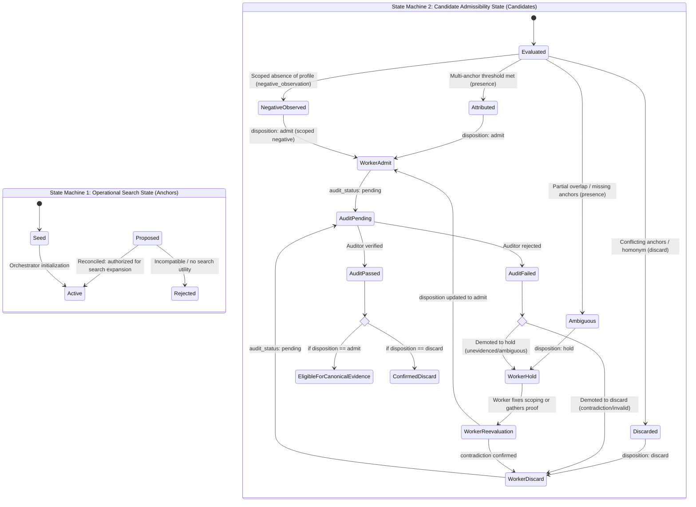

# Research State Schema

## Purpose

Defines the minimal machine-readable state contract exchanged between research workers, orchestrators, and auditors during external presence investigation.

This contract replaces natural-language prose parsing with explicit data structures, enabling deterministic state transitions and clear boundary handoffs.

---

## Core Epistemic Principle

> **Research state is operational state, not truth state.**
>
> - An anchor in research state answers: *"What identifiers am I currently authorized to use to search?"*
> - A candidate in research state answers: *"What external resource have I found, and what is its current disposition?"*
>
> Operational authorization to search with an identifier does not make it verified truth. Neither anchors nor candidate observations become canonical evidence until they survive independent audit and are formalized via `record_evidence`.

| Dimension | Research State (`working-set`) | Canonical Evidence (`evidence/`) |
| :--- | :--- | :--- |
| **Lifecycle** | Transient, mutable working memory. | Durable, immutable repository records. |
| **Purpose** | Drive adaptive search and coordination. | Anchor verified institutional truth. |
| **Audience** | Orchestrator, research workers, auditor. | Stakeholders, architects, future analysis. |
| **Scope** | Includes tentative, hold, and proposed state. | Contains only admitted, audited findings. |

---

## The Two State Machines

Research coordination comprises two distinct state machines with fundamentally different semantics:



### Eligibility Rule for Canonical Evidence:
A candidate record is eligible for formalization in `evidence/` **if and only if**:
$$\text{disposition} == \text{"admit"} \quad \land \quad \text{audit\_status} == \text{"passed"}$$

- Positive presence findings (`candidate_kind: presence`) and scoped negative observations (`candidate_kind: negative_observation`) can both be admitted to evidence if they pass audit.
- Passing an audit on a discard (`disposition: discard`, `audit_status: passed`) confirms that the discard decision was epistemically sound; it does **not** admit the candidate into canonical evidence.

### Re-entry Protocol for Failed Candidates:
A candidate demoted after audit failure (`audit_status: failed`) must be re-evaluated and re-enter `audit_status: pending` before another audit can occur. The state `failed` records the historical outcome of an audit pass; it is not a terminal disposition.

To re-submit a candidate from `hold`:
1. Worker resolves the auditor objection (e.g., narrows temporal scope, separates unevidenced claims, or resolves anchor ambiguity).
2. Worker sets `disposition: admit` (or `discard`).
3. Worker sets `audit_status: pending`.
4. Auditor evaluates the revised candidate.


---

## 1. Anchor State Specification

An anchor is an identifier used to query external systems and evaluate candidate identity.

### Anchor Fields
- `id`: Unique identifier (`ANC-001`, `ANC-002`, ...).
- `value`: Normalized string representation (e.g. `"901380770"`, `"amcsolutionscolombia.com"`).
- `type`: Anchor category:
  - `tax_id` (high strength)
  - `domain` (high strength)
  - `corporate_email` (high strength)
  - `legal_name` (high strength)
  - `phone` (moderate strength)
  - `street_address` (moderate strength)
  - `legal_representative` (moderate strength)
  - `trade_name` (weak strength)
  - `city` (weak strength)
  - `industry_sector` (consistency check only)
- `strength`: `high` | `moderate` | `weak`.
- `status`:
  - `active`: Anchor authorized for query generation and identity matching within the current research state, with provenance and strength recorded. (Search utility, not evidence proof).
  - `proposed`: Newly discovered candidate anchor emitted by a worker, pending orchestrator review.
  - `rejected`: Evaluated candidate anchor discarded due to conflicts, homonymy, or lack of search utility.
- `provenance`: Origin of the anchor (`seed` or source candidate ID like `SRC-001`).
- `discovery_rationale`: Concise explanation of why the anchor was emitted (for `proposed` anchors).

### Anchor State YAML Structure

```yaml
anchor_state:
  active:
    - id: "ANC-001"
      value: "amcsolutionscolombia.com"
      type: "domain"
      strength: "high"
      provenance: "seed"
    - id: "ANC-002"
      value: "901380770"
      type: "tax_id"
      strength: "high"
      provenance: "seed"

  proposed:
    - id: "ANC-003"
      value: "Ledys del Rosario Martínez Lara"
      type: "legal_representative"
      strength: "moderate"
      provenance: "SRC-002"
      discovery_rationale: "Listed as legal representative in municipal contract gazette"

    - id: "ANC-004"
      value: "Carrera 14 # 13 C 60, Edificio Ágora, Of. 308"
      type: "street_address"
      strength: "moderate"
      provenance: "SRC-001"
      discovery_rationale: "Historical administrative address listed in corporate directory"

  rejected: []
```

---

## 2. Candidate Evaluation Specification

Every third-party resource inspected produces a structured candidate entry.

### Candidate Fields
- `id`: Unique source candidate ID (`SRC-001`, `SRC-002`, ...).
- `candidate_kind`: Ontological classification of the finding:
  - `presence`: Positive observation of an entity profile, listing, contract, or mention.
  - `negative_observation`: Scoped absence of observable profile, listing, or entity within the evaluated query sample.
  - `discard`: Evaluated candidate determined to be a homonym or irrelevant hit.
- `source_class`: Source taxonomy tier (1: Official registries, 2: Local platforms/maps, 3: Commercial directories, 4: Press/citations).
- `source_name`: Publishing entity or platform name.
- `url`: Canonical locator inspected.
- `capture_date`: ISO date (`YYYY-MM-DD`) when worker accessed the resource.
- `source_date`: ISO date (`YYYY-MM-DD`) or `null` if undated by the source.
- `relevant_period`: Temporal validity window stated or implied by the record (e.g. `"vigencia fiscal 2023"`, `"actual 2026"`, `"historico / no fechado"`). Prevents past facts from silently being treated as current facts.
- `identity_status`:
  - `attributed`: Confirmed match meeting multi-anchor threshold (used for `presence`).
  - `ambiguous`: Plausible or partial overlap without sufficient anchor strength (used for `presence`).
  - `discarded`: Proven homonym or contradictory identity (used for `discard`).
  - `not_applicable`: Entity identity is not being attributed because no profile was observed (used for `negative_observation`).
- `disposition`:
  - `admit`: Candidate admitted by worker to research pool; awaits audit.
  - `hold`: Retained in research state due to ambiguity or pending anchors.
  - `discard`: Discarded record; preserved to prevent duplicate querying.
- `audit_status`:
  - `pending`: Worker has admitted or evaluated the record; awaiting auditor verification.
  - `passed`: Auditor verified the decision against sources and epistemic rules.
  - `failed`: Rejected by auditor due to contract violation, unsupported claim, or flawed scoping. Demotes to `hold` or `discard`.
- `matched_anchors`: List of anchor IDs matching this candidate (e.g. `["ANC-001", "ANC-002"]`).
- `missing_anchors`: List of anchor types required to resolve ambiguity (used when `disposition: hold`).
- `conflicting_anchors`: List of anchor types that contradicted seed identity (used when `disposition: discard`).
- `proposed_anchors`: List of anchor IDs emitted by this source for potential search space expansion.
- `direct_observations`: Array of strings capturing facts directly visible on the page.
- `source_claims`: Array of strings capturing assertions made by third parties without primary verification.
- `corroboration`:
  - `type`: `identity` | `attribute` | `first_party_consistency` | `independent_external` | `none`.
  - `reference_ids`: Array of source IDs corroborating this entry.
- `confidence`: `high` | `medium` | `low` | `negative_scoped`.
- `open_questions`: Array of strings capturing identified gaps or ambiguities.

### Candidate State YAML Structure

```yaml
candidates:
  - id: "SRC-001"
    candidate_kind: "presence"
    source_class: 3
    source_name: "Portafolio / Informa Colombia"
    url: "https://www.informacolombia.com/..."
    capture_date: "2026-10-08"
    source_date: null
    relevant_period: "historico / no fechado"
    identity_status: "attributed"
    disposition: "admit"
    audit_status: "pending"
    matched_anchors:
      - "ANC-001"
      - "ANC-002"
    missing_anchors: []
    conflicting_anchors: []
    proposed_anchors:
      - "ANC-004"
    direct_observations:
      - "Corporate listing displays AMC SOLUTIONS COLOMBIA S.A.S. with NIT 901380770-0."
      - "Lists three mobile phone lines matching canonical seeds."
      - "Displays administrative address Carrera 14 # 13 C 60, Edificio Ágora, Of. 308."
    source_claims:
      - "Source classifies corporate legal form as Sociedad por Acciones Simplificada."
    corroboration:
      type: "identity"
      reference_ids: ["SRC-002"]
    confidence: "high"
    open_questions:
      - "Is Carrera 14 an active branch or a historical location?"

  - id: "SRC-003"
    candidate_kind: "negative_observation"
    source_class: 2
    source_name: "Google Maps / Búsqueda local Valledupar"
    url: "https://www.google.com/maps"
    capture_date: "2026-10-08"
    source_date: null
    relevant_period: "2026-10-08"
    identity_status: "not_applicable"
    disposition: "admit"
    audit_status: "pending"
    matched_anchors: []
    missing_anchors: []
    conflicting_anchors: []
    proposed_anchors: []
    direct_observations:
      - "In the evaluated sample of search queries for 'AMC Solutions' 'Valledupar' on Google Maps, no verified commercial profile was observed."
    source_claims: []
    corroboration:
      type: "none"
      reference_ids: []
    confidence: "negative_scoped"
    open_questions:
      - "Has AMC Solutions initiated verification for a Google Business Profile?"

  - id: "DISC-001"
    candidate_kind: "discard"
    source_class: 3
    source_name: "Datacrédito Empresas / Cámara de Comercio Bogotá"
    url: "https://www.datacreditoempresas.com.co/"
    capture_date: "2026-10-08"
    source_date: null
    relevant_period: "no aplicable"
    identity_status: "discarded"
    disposition: "discard"
    audit_status: "passed"
    matched_anchors: []
    missing_anchors: []
    conflicting_anchors: ["tax_id", "city", "industry_sector"]
    proposed_anchors: []
    confidence: "high"
```

---

## 3. Scope and Stopping State by Objective

Captures search bounds, phase objectives, and stopping conditions.

> [!IMPORTANT]
> **Stopping conditions belong to the research objective, not research in general:**
> - `identity_resolution` (Phase 1): Stops upon `anchor_sufficiency`.
>   *Definition:* At least two high-strength seed/canonical anchors are available and mutually consistent for candidate identity resolution. (Refers to operational consistency among anchors, NOT audited canonical evidence).
> - `presence_coverage` (Phase 2): Stops upon source-class exhaustion or SERP query limits.
> - `activity_attribution` (Phase 3): Stops upon public records/procurement exhaustion.
> - `serp_boundary_exhaustion` (Phase 4): Stops when query variations yield no new unobserved domains.

```yaml
search_scope:
  phase: 1
  objective: "identity_resolution"
  source_classes_targeted: [1, 3]
  stopping_conditions:
    - condition: "anchor_sufficiency"
      parameter: "2_high_anchors_confirmed"
      status: "satisfied"
    - condition: "max_results_per_query"
      parameter: 20
      status: "satisfied"
  queries_executed:
    - query: "\"AMC SOLUTIONS COLOMBIA S.A.S.\""
      results_inspected: 12
    - query: "\"901380770\""
      results_inspected: 8
```
