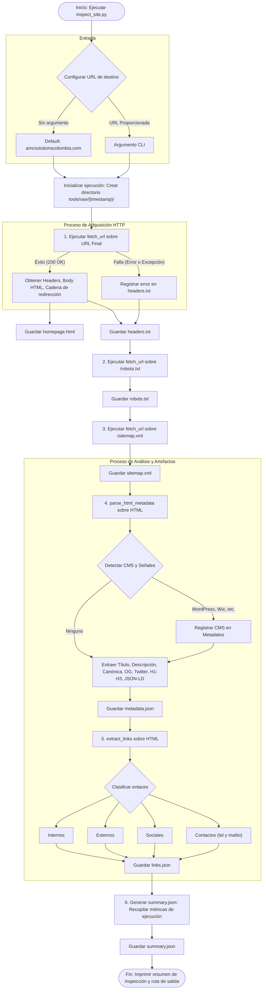
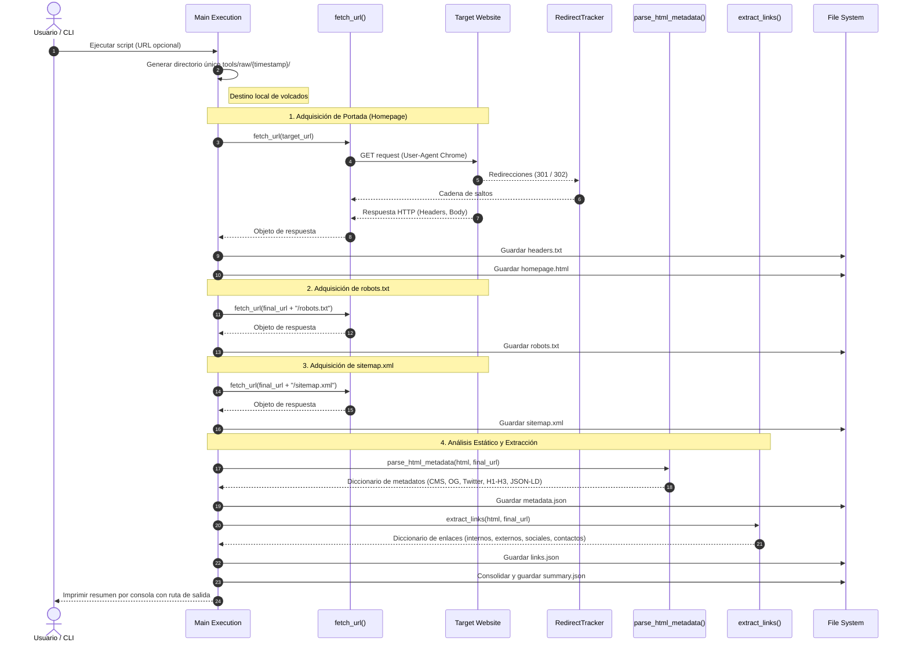

# Flujo de Ejecución — `inspect_site.py`

Documentación visual y diagramas de arquitectura del script de reconocimiento técnico [tools/inspect_site.py](inspect_site.py).

---

## 1. Diagrama de Flujo Lógico

Describe la secuencia de control, la gestión de parámetros y las bifurcaciones de error:

---

## 2. Diagrama de Secuencia Temporal

Describe la interacción temporal entre el usuario, el interceptor de redirecciones, el servidor remoto y el sistema de archivos:

